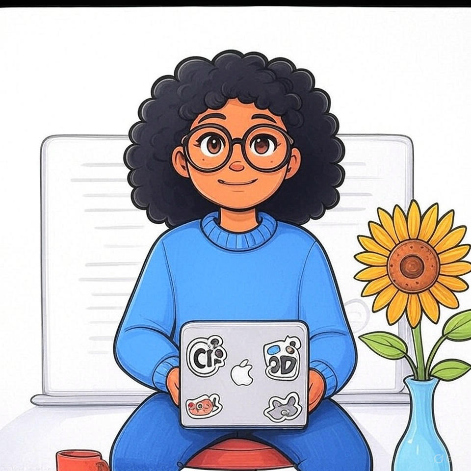

## Hi there, I'm Bahle 👋

### 💻 Third-Year IT Student at Belgium Campus iTversity

Final-year IT student | Software Development | C#/.NET | JavaScript | React | SQL | Azure
Building, breaking and rebuilding things to understand how they work.

---

## 🚀 Tech Stack

---

## 👨‍💻 About Me

I'm a **third-year Information Technology student** at **Belgium Campus iTversity**, passionate about securing digital systems, building intelligent applications, and creating clean, responsive web designs.

### 🎯 Current Focus Areas:

- 🌐 **Web Design** – Crafting responsive and user-friendly interfaces  
- 🤖 **AI & Automation** – Exploring intelligent systems through Python and R  
- 🛠 **Systems Development** – Designing full-stack solutions from database to UI 
- 🔐 **Cybersecurity** – Understanding threats, securing systems, and exploring ethical hacking  
- ☁️ **Cloud Development** – Building scalable cloud-native apps and infrastructure   

---

## 💭 My Approach

> I approach technology with a problem-solving mindset, driven by curiosity and a desire to leave a meaningful impact.  
> From **cybersecurity architecture** to **interactive web design**, I believe in building solutions that are secure, efficient, and people-focused.  
>  
> Whether working with **code, cloud, or data**, I strive to combine **technical depth** with **real-world relevance**, crafting tools that make a difference.

---

## 🚀 What Drives Me

passions:

  - "Web Design & UX"
    icon: "🎨"
    description: "Creating responsive and accessible interfaces with HTML, CSS, and JavaScript"

  - "Database & Data Architecture"
    icon: "🗄️"
    description: "Designing efficient relational and NoSQL database systems"

  - "Systems Integration"
    icon: "🧩"
    description: "Bringing together diverse technologies into secure, scalable systems"
    
  - "Cybersecurity & Ethical Hacking"
    icon: "🛡️"
    description: "Protecting digital ecosystems through secure architecture and ethical practices"

  - "Cloud Development"
    icon: "☁️"
    description: "Deploying scalable, resilient solutions using cloud-native tools"

  - "AI & Data Science"
    icon: "🧠"
    description: "Building intelligent systems using Python, R, and automation tools"

---

## 📊 GitHub Stats

  
  

---

## 📫 Let's Connect

- 📧 Email: [masithole.simphiwe@gmail.com](mailto:masithole.simphiwe@gmail.com)  
- 🔗 LinkedIn: [Bahle Sithole](https://www.linkedin.com/in/bahle-sithole-5ab679310)

---

_“Learning never exhausts the mind.” – Leonardo da Vinci_

